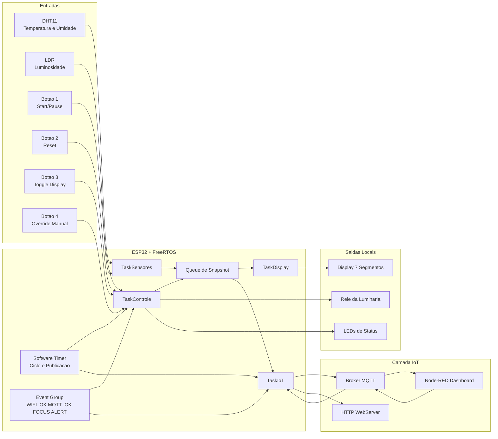

# Fluxograma de Hardware

## Visao Geral

O fluxo abaixo mostra como sensores, botoes, tarefas do `FreeRTOS`, atuadores locais e servicos IoT se conectam dentro da arquitetura da `Estacao de trabalho Inteligente IoT`.



## Leitura do Fluxo

1. `DHT11` e `LDR` alimentam a `TaskSensores`.
2. Os `botoes` alimentam a `TaskControle`.
3. O estado consolidado do sistema passa por uma `Queue`.
4. A `TaskDisplay` usa esse estado para atualizar o display.
5. A `TaskControle` usa esse estado para comandar `rele` e `LEDs`.
6. A `TaskIoT` publica os dados por `MQTT`, atende o `HTTP WebServer` e recebe comandos remotos.
7. O `Software Timer` controla o tempo do ciclo de foco e a periodicidade de eventos.
8. O `Event Group` informa conectividade e estados globais importantes.

## Fluxo Fisico Resumido

```text
DHT11 + LDR + Botoes
    -> ESP32
    -> TaskSensores / TaskControle
    -> Queue / Timer / Event Group
    -> TaskDisplay / TaskIoT
    -> Display / Rele / LEDs / MQTT / HTTP
    -> Node-RED
```

## Mapeamento de Hardware Base

| Bloco | Item | GPIO |
| --- | --- | --- |
| Sensores | `DHT11` | `33` |
| Sensores | `LDR` | `39` |
| Atuador | `Rele` | `13` |
| LED | `LED 1` | `4` |
| LED | `LED 2` | `0` |
| LED | `LED 3` | `2` |
| LED | `LED 4` | `15` |
| Botao | `Botao 1` | `4` |
| Botao | `Botao 2` | `0` |
| Botao | `Botao 3` | `2` |
| Botao | `Botao 4` | `15` |
| Display | `SEG_A` | `18` |
| Display | `SEG_B` | `5` |
| Display | `SEG_C` | `21` |
| Display | `SEG_D` | `3` |
| Display | `SEG_E` | `1` |
| Display | `SEG_F` | `23` |
| Display | `SEG_G` | `22` |
| Display | `SEG_DP` | `19` |
| Display | `DISPLAY_1` | `16` |
| Display | `DISPLAY_2` | `17` |

## Observacao Importante

Como no kit das aulas alguns `GPIOs` sao compartilhados entre `LEDs` e `botoes`, a dupla deve manter a mesma estrategia ja usada no laboratorio para leitura e escrita coerentes na shield.
